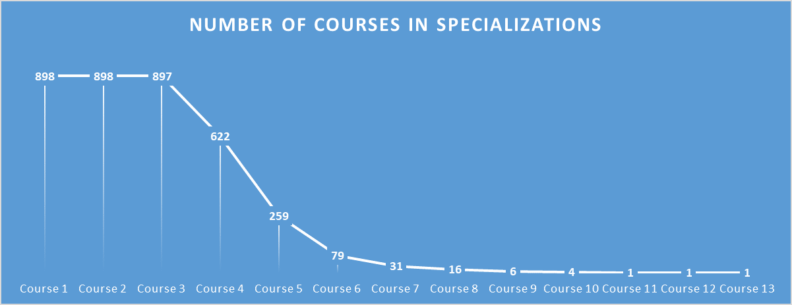
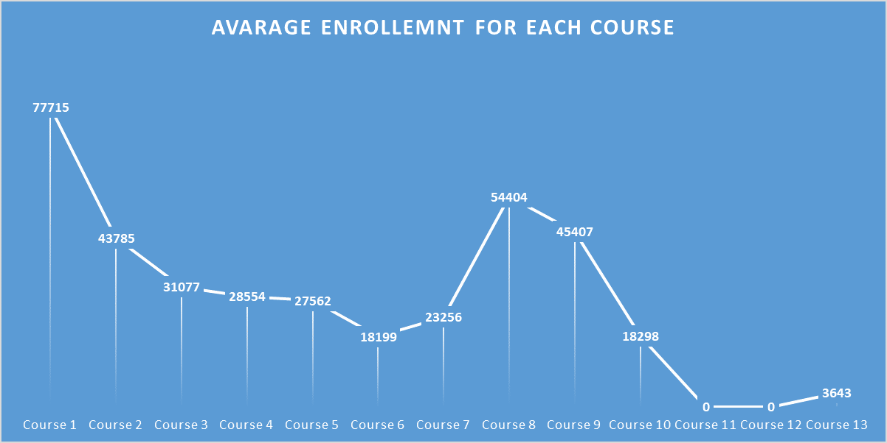
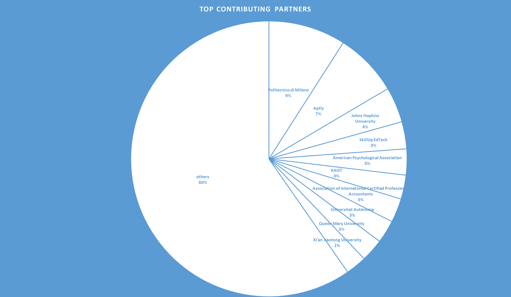

# Coursera Specializations Enrollment Analysis

## Overview

This project involves web scraping data related to Coursera Specializations and analyzing the enrollment numbers of these specializations. Coursera is a popular online learning platform that offers a wide range of courses and specializations. This analysis aims to provide insights into the popularity and trends of specializations on Coursera.

- [Results](#results)

Results
Share the insights and findings from the analysis. Include visualizations, graphs, or tables to support your conclusions. Discuss any trends or patterns discovered in Coursera Specializations enrollment.

